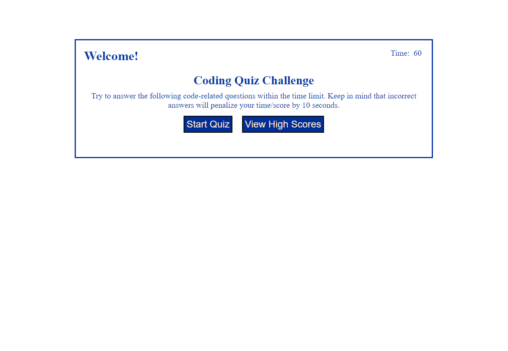

# Code Quiz

## Description

This project was to practice and hone my JavaScript skills I have learned up to now. I used different skills such as local storage, event listeners, setting data attributes, and traversing the DOM. It's also a good way to quiz myself on the basics of HTML, CSS and JavaScript. In the future I can add or change the questions with little effort and to include harder or a larger viarity of questions. 

## Installation

N/A

## Usage

Visit the website https://nicolasflamel.github.io/code-quiz/ to see the working project. You click on the "Start Quiz" button and a series of questions will show up with mutiple choices. If you get a question wrong the timer on the top right will decrease. Quiz ends when you answer all the questions or you run out of time. You will then receive a score and be able to save it with your initials. If you click the "View High Scores" button you can see all scores you have saved as well as be able to clear them all.

## Credits

N/A

## License

N/A